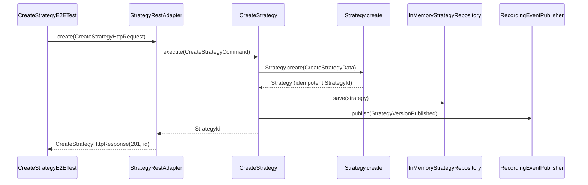

# Example: strategy e2e from REST input adapter

Illustrative only (not production code). Runtime/framework is still TBD — the **web adapter** is a plain class that accepts an HTTP-shaped request DTO. When you pick Spring/Javalin/etc., that framework only translates bytes → this DTO and calls the same adapter.

Context-level e2e = **enter through `adapter.web`**, wire in-memory persistence + a test event bus, assert HTTP-shaped response + side effects.

---

## Request / response at the edge

```java
package com.defistrategyarena.strategy.adapter.web;

import java.util.List;

public record CreateStrategyHttpRequest(
        String ownerId,
        String name,
        List<RuleBody> rules
) {
    public record RuleBody(String id, String type, String instrument, String threshold) {}
}

public record CreateStrategyHttpResponse(int status, String strategyId) {}
```

---

## REST input adapter

Maps transport DTO → application command → use case. No domain rules here.

```java
package com.defistrategyarena.strategy.adapter.web;

import com.defistrategyarena.strategy.application.CreateStrategy;
import com.defistrategyarena.strategy.application.CreateStrategyCommand;
import com.defistrategyarena.strategy.domain.StrategyDefinition;
import com.defistrategyarena.strategy.domain.StrategyId;
import java.util.List;

public final class StrategyRestAdapter {

    private static final int STATUS_CREATED = 201;

    private final CreateStrategy createStrategy;

    public StrategyRestAdapter(StrategyRestAdapterDeps deps) {
        this.createStrategy = deps.createStrategy();
    }

    public CreateStrategyHttpResponse create(CreateStrategyHttpRequest request) {
        CreateStrategyCommand command =
                new CreateStrategyCommand(request.ownerId(), toDefinition(request));
        StrategyId id = createStrategy.execute(command);
        return new CreateStrategyHttpResponse(STATUS_CREATED, id.value());
    }

    private static StrategyDefinition toDefinition(CreateStrategyHttpRequest request) {
        List<StrategyDefinition.Rule> rules =
                request.rules().stream().map(StrategyRestAdapter::toRule).toList();
        return StrategyDefinition.create(new StrategyDefinition(request.name(), rules));
    }

    private static StrategyDefinition.Rule toRule(CreateStrategyHttpRequest.RuleBody body) {
        return new StrategyDefinition.Rule(
                body.id(),
                new StrategyDefinition.PriceAbove(body.instrument(), body.threshold()),
                new StrategyDefinition.Hold());
    }

    public record StrategyRestAdapterDeps(CreateStrategy createStrategy) {}
}
```

Later, with a real HTTP stack:

```text
POST /strategies  JSON body
    → framework binds JSON to CreateStrategyHttpRequest
    → strategyRestAdapter.create(request)
    → 201 + { "strategyId": "..." }
```

---

## E2E test (frozen after approval)

Enters **only** via the REST adapter — not by calling `CreateStrategy` directly.

```java
package com.defistrategyarena.strategy.e2e;

import static org.junit.jupiter.api.Assertions.assertEquals;
import static org.junit.jupiter.api.Assertions.assertTrue;

import com.defistrategyarena.shared.events.strategy.StrategyVersionPublished;
import com.defistrategyarena.shared.messaging.DomainEvent;
import com.defistrategyarena.shared.messaging.DomainEventPublisher;
import com.defistrategyarena.strategy.adapter.persistence.InMemoryStrategyRepository;
import com.defistrategyarena.strategy.adapter.web.CreateStrategyHttpRequest;
import com.defistrategyarena.strategy.adapter.web.CreateStrategyHttpResponse;
import com.defistrategyarena.strategy.adapter.web.StrategyRestAdapter;
import com.defistrategyarena.strategy.application.CreateStrategy;
import com.defistrategyarena.strategy.domain.StrategyId;
import java.util.ArrayList;
import java.util.List;
import org.junit.jupiter.api.BeforeEach;
import org.junit.jupiter.api.Test;

class CreateStrategyE2ETest {

    private static final int STATUS_CREATED = 201;
    private static final String OWNER_ID = "user-42";
    private static final String STRATEGY_NAME = "rsi-bounce";

    private InMemoryStrategyRepository strategies;
    private RecordingEventPublisher events;
    private StrategyRestAdapter http;

    @BeforeEach
    void setUp() {
        strategies = new InMemoryStrategyRepository();
        events = new RecordingEventPublisher();
        CreateStrategy useCase =
                new CreateStrategy(new CreateStrategy.CreateStrategyDeps(strategies, events));
        http = new StrategyRestAdapter(new StrategyRestAdapter.StrategyRestAdapterDeps(useCase));
    }

    @Test
    void creates_private_strategy_via_rest_adapter_and_emits_version_published() {
        CreateStrategyHttpRequest request =
                new CreateStrategyHttpRequest(
                        OWNER_ID,
                        STRATEGY_NAME,
                        List.of(
                                new CreateStrategyHttpRequest.RuleBody(
                                        "r1", "price_above", "ETH-USD", "3000")));

        CreateStrategyHttpResponse response = http.create(request);

        assertEquals(STATUS_CREATED, response.status());
        StrategyId id = new StrategyId(response.strategyId());
        assertEquals(OWNER_ID, strategies.get(id).ownerId());
        assertEquals(STRATEGY_NAME, strategies.get(id).current().definition().name());
        assertTrue(
                events.published().stream().anyMatch(StrategyVersionPublished.class::isInstance));
    }

    @Test
    void same_owner_and_name_yield_same_strategy_id() {
        CreateStrategyHttpRequest request =
                new CreateStrategyHttpRequest(OWNER_ID, STRATEGY_NAME, List.of());

        String first = http.create(request).strategyId();
        String second = http.create(request).strategyId();

        assertEquals(first, second);
    }

    private static final class RecordingEventPublisher implements DomainEventPublisher {
        private final List<DomainEvent> published = new ArrayList<>();

        @Override
        public void publish(DomainEvent event) {
            published.add(event);
        }

        private List<DomainEvent> published() {
            return List.copyOf(published);
        }
    }
}
```

---

## Sequence



---

## What this e2e is / is not

| Is | Is not |
| --- | --- |
| Context boundary through **REST adapter** | Full browser / Playwright |
| Real application + domain wiring | Unit test of mapper only |
| In-memory outbound adapters | Real DB / message broker |
| Frozen after user approval | Edited to green the build |

Unit tests still cover edge cases (invalid DSL, privacy transitions) without going through HTTP DTOs.
