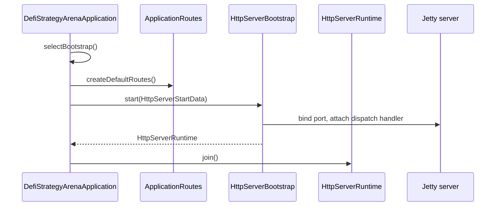

# HTTP server bootstrap

## Purpose

Start the HTTP API using a pluggable runtime bootstrap. All Jetty (or future Helidon) code lives in `shared.infra`; the composition root picks which bootstrap to run so the runtime can be swapped without touching bootstrap implementations or bounded contexts.

## Actors

- `DefiStrategyArenaApplication` (composition root / `main`)
- `bootstrap.ApplicationRoutes` (route wiring)
- `shared.infra.http` (ports: `HttpServerBootstrap`, `HttpRouteRegistry`, …)
- `shared.infra.http.jetty` (Jetty adapter today)

## Sequence

## Walkthrough

1. `main` calls `selectBootstrap()`, which returns a concrete `HttpServerBootstrap` (currently `JettyHttpServerBootstrap`).
2. `ApplicationRoutes.createDefaultRoutes()` builds an `InMemoryHttpRouteRegistry` and registers handlers (e.g. `GET /health`).
3. `start(bootstrap)` wraps config + routes in `HttpServerStartData` and delegates to the bootstrap.
4. The Jetty bootstrap creates a virtual-thread-backed thread pool, binds the configured port, and installs `JettyRouteDispatchHandler`, which maps Jetty requests to `HttpHandler` entries in the registry.
5. The returned `HttpServerRuntime` exposes `port()`, `join()`, and `close()`; `main` blocks on `join()` until shutdown.

To switch runtime later, change only `selectBootstrap()` (e.g. return `HelidonHttpServerBootstrap`) — bounded contexts and route wiring stay unchanged.

## Errors / edge cases

- Unknown route → `404` with plain-text body from `JettyRouteDispatchHandler`.
- Invalid config (negative port) → `IllegalArgumentException` at `HttpServerConfig` construction.
- Stop failure → `IllegalStateException` from `JettyHttpServerRuntime.close()`.
