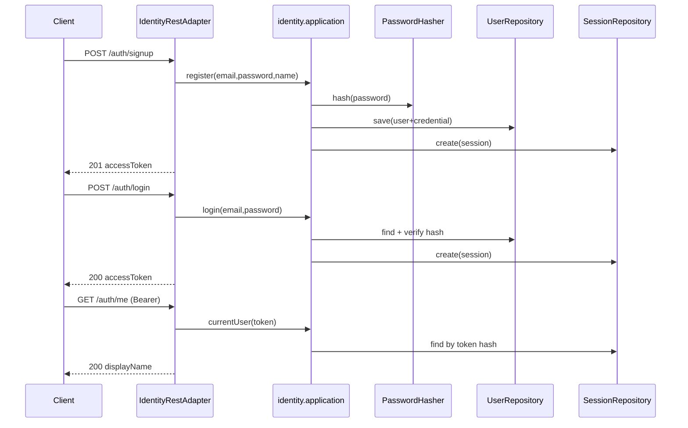

# Identity authentication (sign-up / sign-in)

## Purpose

Register and authenticate users with email/password, and issue opaque Bearer sessions for API clients.

## Actors

- `identity.adapter.web` (`IdentityRestAdapter`, HTTP handlers)
- `identity.application` (signup / login / logout / me)
- `identity.domain` (User, Session, password hash value types)
- `identity.adapter.persistence` (in-memory for memory mode; jOOQ for postgres mode)
- `identity.adapter.crypto` (PBKDF2 hasher, session token factory)
- `bootstrap` (routes + composition)
- `shared.infra.http` (Authorization header on `HttpRequest`)

## Sequence

## Walkthrough

1. Signup validates email/password, hashes with PBKDF2, persists user + password row, creates session, returns raw token once (no `userId` in the body).
2. Login verifies hash; issues new session (token only).
3. `Authorization: Bearer` resolves session by token hash; expired/missing → `401`.
4. `GET /auth/me` returns only the user's `displayName` for the session.
5. Logout deletes session row.

Identity persistence: **in-memory** when `DSA_PERSISTENCE_MODE=memory`; **Postgres** (`users`, `user_passwords`, `auth_sessions`) via jOOQ when mode is `postgres`.

## Errors / edge cases

| Case | HTTP |
| --- | --- |
| Duplicate email | `409` |
| Bad credentials | `401` |
| Missing/invalid Bearer | `401` |
| Invalid signup/login body | `400` |
