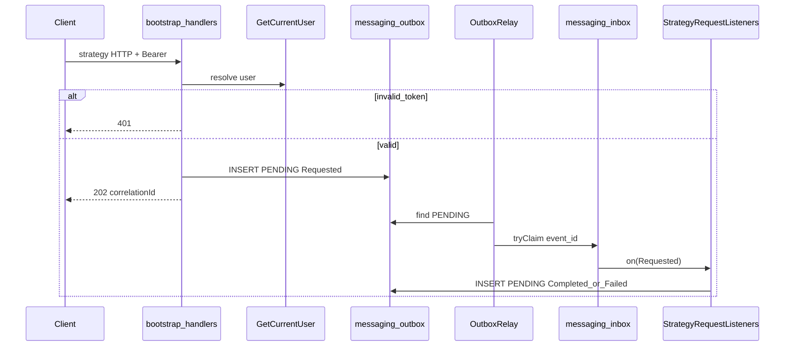

# Strategy authenticated async (outbox / inbox)

## Purpose

Accept strategy HTTP commands with a Bearer session, resolve the owner internally, and process work asynchronously through a transactional outbox/inbox so delivery is durable (Postgres) without sync context-to-context calls.

## Actors

- `bootstrap` (HTTP handlers, `AuthenticatedStrategyPublisher`)
- `identity.application` (`GetCurrentUser`)
- `shared.messaging` / `shared.infra.messaging` (outbox, inbox, relay, codec)
- `strategy.adapter.messaging` (`StrategyRequestListeners`)
- `strategy.application` (use cases)

## Sequence

## Walkthrough

1. Handler requires Bearer; invalid/expired → `401` and no outbox row.
2. Valid user → new `correlationId`, publish `*Requested` via `TransactionalOutboxPublisher` (append PENDING).
3. Handler calls `OutboxRelay.drain()` (in-process) then returns `202` + `correlationId`.
4. Relay claims inbox row per outbox id, dispatches listeners, marks outbox PUBLISHED.
5. Listeners run strategy use cases and publish `*Completed` / `*Failed` (and create/update still emit `StrategyVersionPublished`) onto the outbox.
6. A later phase will consume response events for HTTP/client delivery.

## Errors / edge cases

| Case | Behavior |
| --- | --- |
| Missing/invalid Bearer | `401` |
| Duplicate create | `CreateStrategyFailed` reason `DUPLICATE` in outbox |
| Not found get/update/delete | `*Failed` reason `NOT_FOUND` |
| Duplicate inbox delivery | `tryClaim` false → skip listener, still mark published |
