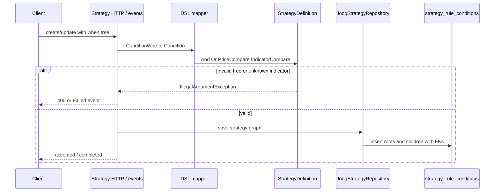

# Strategy condition trees

## Purpose

Validate and persist strategy rules whose **when** clause is an AND/OR tree of leaf comparisons; the tree evaluates (later) to whether the rule’s **then** action applies.

## Actors

- `strategy.domain` — sealed `Condition` tree + `Action`
- `strategy.adapter.dsl` — wire ↔ domain mapping
- `strategy.adapter.persistence` — `strategy_rules` + `strategy_rule_conditions`
- `shared.indicators` — catalog validation for indicator leaves
- `shared.messaging` — create/update/get payloads

## Sequence

## Walkthrough

1. Client sends recursive `when` (`and` / `or` / leaf compares) plus `then` action.
2. DSL maps wire → domain; AND/OR require non-empty children; indicator leaves must exist in `IndicatorCatalog`.
3. Repository writes one `strategy_rules` row and a forest of `strategy_rule_conditions` (null parent = root).
4. Indicator leaves store `indicator_id` FK resolved by catalog code.

## Errors / edge cases

| Case | Surface |
| --- | --- |
| Empty AND/OR | reject |
| Unknown indicator code | reject |
| Missing required indicator params | reject |
| Missing root / multiple roots on load | illegal state |
