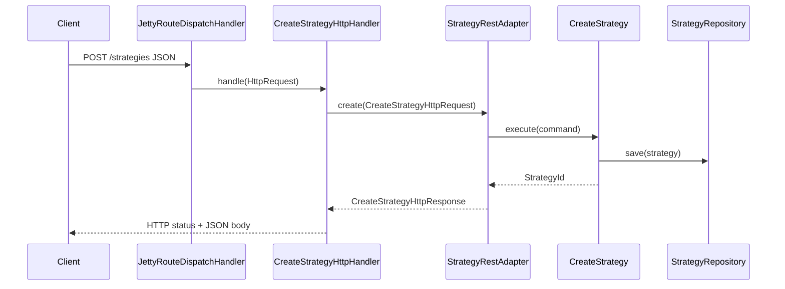

# Create strategy over HTTP (Jetty)

## Purpose

Accept `POST /strategies` JSON at the Jetty edge, map to `StrategyRestAdapter`, and return an HTTP-shaped JSON response — without importing Jetty or `shared.infra` into the strategy hexagonal layers.

## Actors

- `bootstrap.ApplicationRoutes` / `CreateStrategyHttpHandler`
- `bootstrap.ApplicationComposition`
- `strategy.adapter.web.StrategyRestAdapter`
- `shared.infra.http` + Jetty bootstrap
- `shared.messaging.InMemoryDomainEventPublisher`

## Sequence

## Walkthrough

1. Composition root builds `ApplicationComposition` (repo, publisher, adapter).
2. `ApplicationRoutes` registers `POST /strategies` to `CreateStrategyHttpHandler`.
3. Handler deserializes JSON with Jackson into `CreateStrategyHttpRequest`.
4. Calls `StrategyRestAdapter.create` (phase-1 behavior unchanged).
5. Serializes `CreateStrategyHttpResponse` and returns status + `application/json`.

## Errors / edge cases

| Case | Surface |
| --- | --- |
| Invalid JSON | `400` + empty strategy id JSON |
| Duplicate owner+name | `409` from adapter |
| Validation failures | `400` from adapter |
