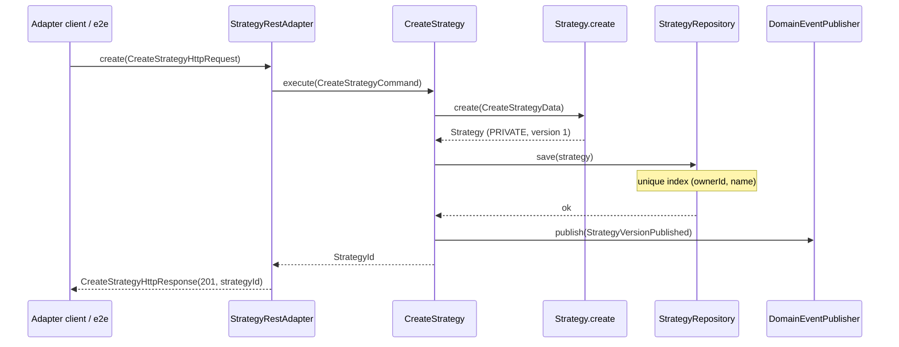
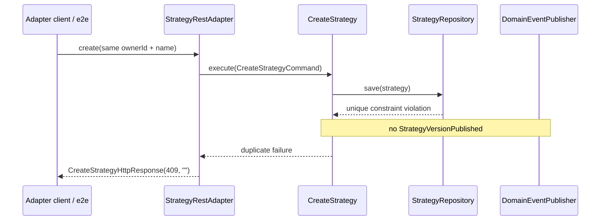

# Create private strategy

## Purpose

Accept an HTTP-shaped create request at the strategy context boundary, build a private strategy aggregate, persist it under a **unique `(ownerId, name)`** constraint, and publish `StrategyVersionPublished` only when insert succeeds — so other contexts can react without importing `strategy.*`.

## Actors

- `strategy.adapter.web` — `StrategyRestAdapter`
- `strategy.application` — `CreateStrategy`
- `strategy.domain` — `Strategy` / `StrategyDefinition`
- `strategy.adapter.persistence` — `StrategyRepository` implementation (in-memory in e2e; enforces unique owner+name)
- `shared.messaging` — `DomainEventPublisher`
- `shared.events.strategy` — `StrategyVersionPublished`

## Sequence (happy path)

## Sequence (duplicate owner + name)

## Walkthrough

1. Client (e2e or future Jetty handler) calls `StrategyRestAdapter.create` with owner, name, and optional rules.
2. Adapter maps HTTP DTOs to `CreateStrategyCommand` / domain `StrategyDefinition` (phase 1: `price_above` → hold).
3. `CreateStrategy` asks `Strategy.create(...)`, which assigns a `StrategyId` (idempotent UUID from fields is fine for a first insert).
4. Aggregate is saved through `StrategyRepository`. The adapter/DB **must** reject a second row with the same `(ownerId, name)`.
5. On success only: `StrategyVersionPublished` is published with strategy id, version number `1`, and owner id; adapter returns `201` + `strategyId`. E2E must reload the aggregate from the repository and assert it matches the request.
6. On unique-key conflict: adapter returns `409`; store unchanged (still one row for that owner+name); no extra event.

## Errors / edge cases

| Case | Surface |
| --- | --- |
| Blank owner or name | Validation failure before persist / event |
| Unknown rule `type` | Validation failure at adapter or application boundary |
| Repeat create same owner+name | Persistence unique constraint → HTTP-shaped `409`; store unchanged; no new event |

Product scenarios: [`docs/phases/phase-1-strategy-create.md`](../phases/phase-1-strategy-create.md).
