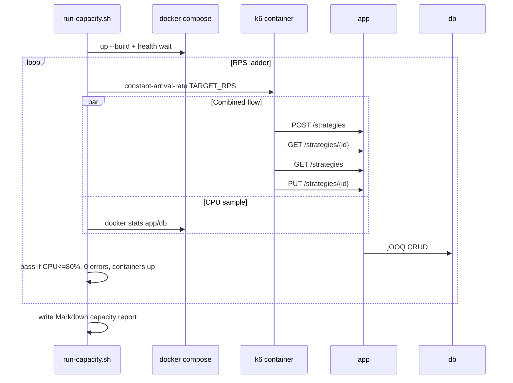

# Strategy CRUD combined-flow load test

## Purpose

Probe Compose-backed Postgres persistence under a mixed strategy HTTP workload to find the highest sustained combined-flow RPS that stays within CPU and error budgets.

## Actors

- `scripts/loadtest/run-capacity.sh` (orchestrator)
- k6 (`strategy-crud.js`) via Docker image
- `app` + `db` Compose services
- `docs/load-tests/strategy-crud-capacity.md` (generated report)

## Sequence

## Walkthrough

1. Stack starts with load-test resource limits (2g heap / 2.5g app container; Postgres 2g / 4 CPU).
2. Each ladder step holds a fixed combined-flow arrival rate for `DURATION`.
3. One flow = create + get one + list + update (≈ 4 HTTP calls).
4. Stage fails on any HTTP/check/flow error, container exit (OOM), or peak CPU above **80% of that service’s CPU quota**.
5. Report records per-stage peaks, HTTP/flow latency percentiles (p50/p90/p95/p99), and the highest graceful RPS.

## Errors / edge cases

- API not ready after compose up → runner exits before probing.
- k6 cannot reach host (`host.docker.internal`) → all stages fail; set `BASE_URL` / networking for the environment.
- Duplicate strategy names are avoided with VU/iter/timestamp suffixes.
