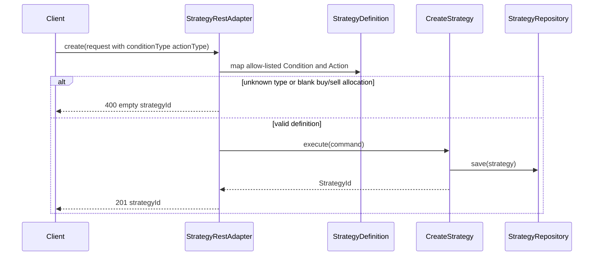

# Strategy DSL catalog (create mapping)

## Purpose

Map HTTP create `RuleBody` values onto the locked v1 sealed `Condition` / `Action` catalog, reject unknown types and invalid buy/sell payloads, and persist only successful creates.

## Actors

- `strategy.adapter.web.StrategyRestAdapter`
- `strategy.domain.StrategyDefinition` (sealed DSL)
- `strategy.application.CreateStrategy`
- `strategy.adapter.persistence` (repository)
- `shared.messaging` (events on success only)

## Sequence

## Walkthrough

1. Client sends `CreateStrategyHttpRequest` with rules using `conditionType` / `actionType`.
2. Adapter maps each rule: price/indicator condition + hold/buy/sell action.
3. Unknown condition/action or blank allocation on buy/sell throws `IllegalArgumentException` → HTTP `400`, nothing persisted.
4. Valid definitions go through `CreateStrategy` (unchanged uniqueness / event rules).

## Errors / edge cases

| Case | Surface |
| --- | --- |
| Unknown `conditionType` / `actionType` | `400`, not persisted |
| `buy`/`sell` blank `allocationPercent` or `instrument` | `400`, not persisted |
| Duplicate owner+name | `409` (phase 1) |
