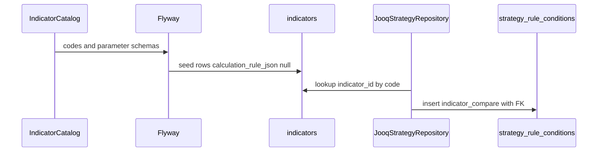

# Strategy indicators catalog

## Purpose

Provide a shared, calculation-free indicator catalog used by strategy DSL validation and persisted as the `indicators` table so rules can FK-bind leaves. Later, `calculation_rule_json` will hold computation recipes (marketdata).

## Actors

- `shared.indicators` — `IndicatorCatalog` definitions and parameter specs
- Flyway — seed `indicators` rows
- `strategy.adapter.persistence` — resolve code → `indicator_id` on save; join on load
- UI — TypeScript mirror of indicator codes/params

## Sequence

## Walkthrough

1. Catalog defines `sma`, `ema`, `rsi`, `bollinger_bands`, `macd` with parameter specs.
2. Migration seeds matching rows; `calculation_rule_json` left null.
3. On strategy save, each indicator leaf resolves `code` → UUID FK.
4. UI embeds the same codes for pickers (no calculation).

## Errors / edge cases

| Case | Surface |
| --- | --- |
| Unknown code in rule | reject before persist |
| Missing seed row | repository failure (ops) |
| Future calc column null | expected this phase |
