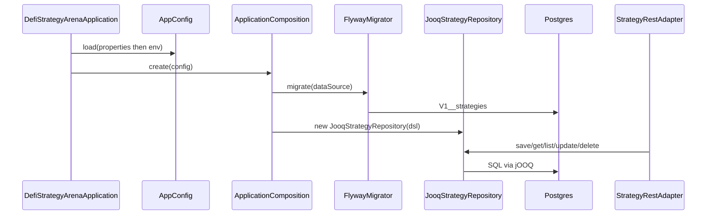

# Strategy persistence (Postgres + jOOQ)

## Purpose

Load config, migrate schema with Flyway, and serve strategy CRUD through `JooqStrategyRepository` when `persistence.mode=postgres`.

## Actors

- `bootstrap.AppConfig` / `ApplicationComposition`
- `shared.infra.persistence` (Hikari, Flyway, jOOQ `DSLContext`)
- `strategy.adapter.persistence.JooqStrategyRepository`
- `strategy.application` use cases / `StrategyRestAdapter`
- PostgreSQL

## Sequence

## Walkthrough

1. `AppConfig.load()` reads classpath `app.properties`, then applies non-blank `DSA_*` env overrides.
2. For `POSTGRES`, composition builds Hikari pool, runs Flyway, opens jOOQ `DSLContext`, wires use cases.
3. Create persists a row; duplicate unique key → `DuplicateStrategyException` → HTTP `409`.
4. Update replaces version number + definition JSON; delete removes the row.
5. `createDefault()` skips config and always uses InMemory (context e2e).

## Errors / edge cases

- Unknown / wrong-owner strategy → application `404` (unchanged).
- Blank owner / invalid rules → `400` (unchanged).
- Unique `(owner_id_normalized, name_normalized)` violation → `409`.
- Missing `app.properties` or invalid `persistence.mode` → startup failure.
- Compose load-test baseline: app heap 2g in a 2.5g container (pool 10); Postgres 2g / 4 CPU with `shared_buffers=512MB` and `max_connections=100`.
