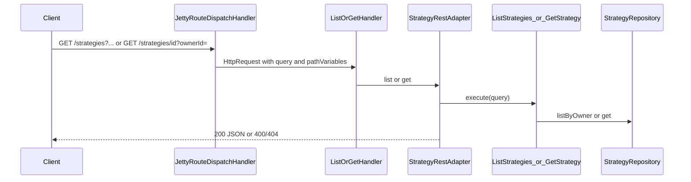

# Strategy reads (list + get)

## Purpose

Owner-scoped read APIs: paginated/sorted list and single-strategy detail, without exposing other owners’ private strategies.

## Actors

- `bootstrap` GET handlers + `ApplicationRoutes`
- `strategy.adapter.web.StrategyRestAdapter`
- `strategy.application.ListStrategies` / `GetStrategy`
- `strategy.adapter.persistence.InMemoryStrategyRepository`
- `shared.infra.http` (query map, path template match, Jetty)

## Sequence

## Walkthrough

1. Jetty parses query string and matches exact or `{strategyId}` template routes.
2. List handler builds `ListStrategiesQuery` (defaults + validation).
3. Repository filters by owner, sorts, slices page, returns total.
4. Get loads by id and requires matching `ownerId`; otherwise adapter returns `404`.

## Errors

| Case | Surface |
| --- | --- |
| Blank owner | `400` |
| Invalid page/size/sort/order | `400` |
| Missing / foreign strategy | `404` |
