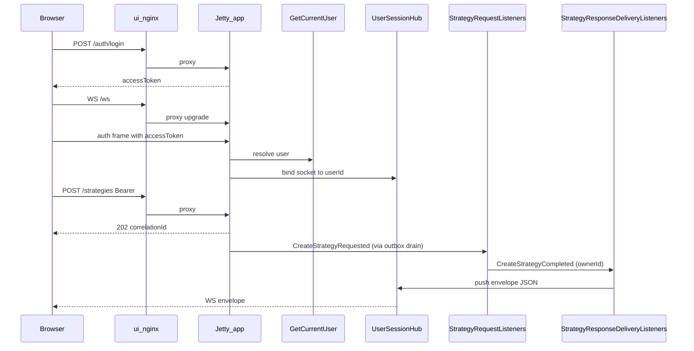

# Strategy response WebSocket delivery

## Purpose

Deliver strategy command outcomes (`*Completed` / `*Failed`) to the owning user’s open browser session over WebSocket, matched by `correlationId` to the HTTP `202` accept response.

## Actors

- Browser (`ui` nginx origin)
- `shared.infra.http.jetty` (`JettyUserSessionWebSocket`, `/ws`)
- `identity.application` (`GetCurrentUser` via `WebSocketAccessTokenAuth`)
- `integration` (`UserSessionHub`, `StrategyResponseDeliveryListeners`)
- `strategy.adapter.messaging` (`StrategyRequestListeners` producing response events)
- `shared.messaging` (outbox / relay)

## Sequence

## Walkthrough

1. After login/signup the UI stores the opaque `accessToken` and opens `ws(s)://{location.host}/ws` (relative to the UI origin — never hardcode `app` or `localhost:8080` in client code).
2. First text frame must be `{ "type":"auth", "accessToken":"..." }`. Invalid tokens get `{ "type":"auth","status":"failed" }` and the socket closes; success replies `status: ok` and registers the socket under `userId`.
3. Strategy HTTP calls remain async: `202` + `correlationId` only.
4. Request listeners emit `*Completed` / `*Failed` carrying `ownerId` + `correlationId`.
5. Integration delivery listeners encode `{ correlationId, type, status, payload }` and `UserSessionHub.push` to all sockets for that owner.
6. The UI resolves the in-flight promise for that `correlationId` and updates local state. Envelopes that arrive before the client registers the waiter are buffered briefly (needed because outbox `drain()` can push before the `202` fetch promise settles).

## Errors / edge cases

| Case | Behavior |
| --- | --- |
| Auth frame missing/invalid | `auth/failed` + close; no hub registration |
| No open socket for owner | Push is a no-op (HTTP 202 already returned) |
| Failed strategy outcome | Envelope `status: failed`, `payload.reasonCode` |
| App restart | Sessions and users persist in Postgres; valid Bearer tokens continue to work until TTL |
| Multi-instance deploy | Hub is process-local — not sticky across nodes yet |
