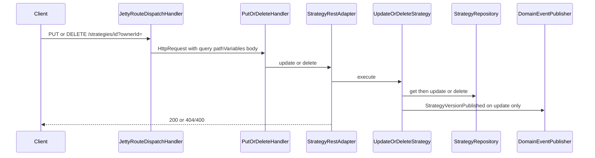

# Strategy update and delete

## Purpose

Owner-scoped update (new version of rules only; name immutable) and hard delete of a strategy.

## Actors

- `bootstrap` PUT/DELETE handlers + `ApplicationRoutes`
- `strategy.adapter.web.StrategyRestAdapter`
- `strategy.application.UpdateStrategy` / `DeleteStrategy`
- `strategy.domain.Strategy` / `StrategyVersion`
- `strategy.adapter.persistence.InMemoryStrategyRepository`
- `shared.messaging` / `shared.events.strategy` (update publishes `StrategyVersionPublished`)

## Sequence

## Walkthrough

1. Jetty matches `PUT`/`DELETE` on `/strategies/{strategyId}` and fills path + query.
2. Update loads the strategy for owner, builds a new definition with the **same name** and replacement rules, persists via `update`, publishes `StrategyVersionPublished`.
3. Delete loads for owner then removes the aggregate and owner-name index entry.
4. Missing strategy or mismatched owner surfaces as `404`; blank owner or bad rules as `400`.

## Errors / edge cases

| Case | Surface |
| --- | --- |
| Blank / missing `ownerId` | `400` |
| Unknown id or wrong owner | `404` |
| Empty / invalid rules on update | `400` |
| Rename attempted | Not in API — body has no `name` |
