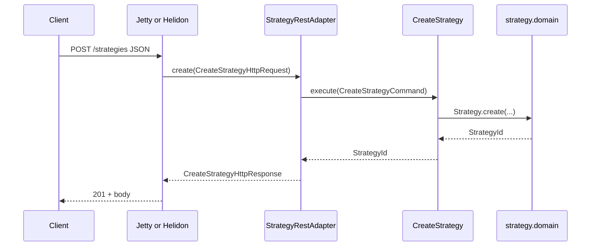

# HTTP server comparison: Embedded Jetty 12 vs Helidon SE 4

Decision input for the DeFi Strategy Arena edge. Both options avoid Spring and work with **virtual threads**. Both can sit in front of our existing hexagonal shape:

```text
HTTP bytes → server binding → adapter.web DTO → StrategyRestAdapter → application → domain
```

Runtime/framework choice affects **only** bootstrap + `adapter.web` wiring. Domain and application stay unchanged.

---

## Summary

| Dimension | Embedded **Jetty 12** | **Helidon SE 4** (Níma) |
| --- | --- | --- |
| Philosophy | Battle-tested servlet/connector engine you embed | Loom-first micro-runtime (Helidon “Níma”) |
| Virtual threads | Explicit VT executor / Jetty VT support | Core design: blocking handlers on VT by default |
| Programming model | `Handler` / servlet-style, or raw `HttpServlet` | `HttpRouting` + service handlers (SE APIs) |
| Load tuning knobs | Very deep (connectors, acceptors, selectors, queues, HTTP/2, buffers, timeouts) | Good, fewer “classic servlet container” dials |
| Ecosystem maturity | Extremely mature in production JVM estates | Modern; strong for new Loom-era services |
| Dependency weight | Jetty modules you opt into | Helidon SE BOM / modules |
| Learning curve | Familiar if you’ve seen Jetty/Tomcat | New SE APIs; less “servlet world” |
| Fit with our `StrategyRestAdapter` | Excellent — thin handler calls adapter | Excellent — thin route calls adapter |
| Risk | Easy to drag in servlet/Jakarta surface area if undisciplined | Helidon opinions / upgrade cadence |

**Neither is a full application framework** in the Spring sense. Both can stay “just HTTP.”

---

## Shared target shape (our code)

We already want this edge contract (illustrative):

```java
package com.defistrategyarena.strategy.adapter.web;

public record CreateStrategyHttpRequest(
        String ownerId,
        String name,
        java.util.List<RuleBody> rules
) {
    public record RuleBody(String id, String type, String instrument, String threshold) {}
}

public record CreateStrategyHttpResponse(int status, String strategyId) {}

public final class StrategyRestAdapter {
    public CreateStrategyHttpResponse create(CreateStrategyHttpRequest request) {
        // maps to CreateStrategyCommand → application → domain
        throw new UnsupportedOperationException("illustrative");
    }
}
```

The server’s only job: parse JSON → `CreateStrategyHttpRequest` → call `create` → write status + body.

---

## Option A — Embedded Jetty 12

### Why consider it

- Proven under heavy traffic for decades.
- Fine-grained **load configuration** (thread pools, connectors, HTTP/2, idle timeouts, request buffers).
- Virtual threads: run request handling on `Executors.newVirtualThreadPerTaskExecutor()` (and Jetty 12 VT integrations).
- No Spring required: `Server` + `ServerConnector` + a `Handler` in our bootstrap module.

### Sketch: bootstrap + handler

```java
package com.defistrategyarena.bootstrap.http;

import com.defistrategyarena.strategy.adapter.web.CreateStrategyHttpRequest;
import com.defistrategyarena.strategy.adapter.web.CreateStrategyHttpResponse;
import com.defistrategyarena.strategy.adapter.web.StrategyRestAdapter;
import com.fasterxml.jackson.databind.ObjectMapper;
import java.nio.charset.StandardCharsets;
import java.util.concurrent.Executors;
import org.eclipse.jetty.server.Handler;
import org.eclipse.jetty.server.Request;
import org.eclipse.jetty.server.Response;
import org.eclipse.jetty.server.Server;
import org.eclipse.jetty.server.ServerConnector;
import org.eclipse.jetty.util.Callback;
import org.eclipse.jetty.util.thread.QueuedThreadPool;

public final class JettyHttpBootstrap {

    private static final int PORT = 8080;
    private static final int ACCEPTORS = 1;
    private static final int SELECTORS = 1;

    private JettyHttpBootstrap() {}

    public static Server start(StrategyRestAdapter strategies) throws Exception {
        QueuedThreadPool platformPool = new QueuedThreadPool();
        platformPool.setName("jetty-platform");

        Server server = new Server(platformPool);

        ServerConnector connector = new ServerConnector(server, ACCEPTORS, SELECTORS);
        connector.setPort(PORT);
        server.addConnector(connector);

        server.setHandler(new CreateStrategyHandler(strategies, new ObjectMapper()));

        server.start();
        return server;
    }
}

final class CreateStrategyHandler extends Handler.Abstract {

    private static final String PATH = "/strategies";
    private static final String METHOD_POST = "POST";
    private static final String CONTENT_JSON = "application/json";

    private final StrategyRestAdapter strategies;
    private final ObjectMapper json;

    CreateStrategyHandler(StrategyRestAdapter strategies, ObjectMapper json) {
        this.strategies = strategies;
        this.json = json;
    }

    @Override
    public boolean handle(Request request, Response response, Callback callback) throws Exception {
        if (!PATH.equals(Request.getPathInContext(request)) || !METHOD_POST.equals(request.getMethod())) {
            Response.writeError(request, response, callback, 404);
            return true;
        }

        // Prefer running business work on a virtual thread if this handler is invoked
        // from a platform carrier thread (exact wiring depends on Jetty VT configuration).
        CreateStrategyHttpRequest body =
                json.readValue(Request.asInputStream(request), CreateStrategyHttpRequest.class);
        CreateStrategyHttpResponse result = strategies.create(body);

        response.setStatus(result.status());
        response.getHeaders().put("Content-Type", CONTENT_JSON);
        byte[] payload =
                json.writeValueAsString(java.util.Map.of("strategyId", result.strategyId()))
                        .getBytes(StandardCharsets.UTF_8);
        response.write(true, java.nio.ByteBuffer.wrap(payload), callback);
        return true;
    }
}
```

### Virtual threads (Jetty-oriented)

Illustrative pattern — run accepted work on VT:

```java
package com.defistrategyarena.bootstrap.http;

import java.util.concurrent.ExecutorService;
import java.util.concurrent.Executors;

public final class VirtualThreadWorkers {

    private VirtualThreadWorkers() {}

    public static ExecutorService requestExecutor() {
        return Executors.newVirtualThreadPerTaskExecutor();
    }
}
```

Jetty 12 can also be configured so the server uses virtual threads for request handling (version-specific `VirtualThreadPool` / EE10 VT options). Prefer **one** clear policy: platform threads for I/O reactor if needed, **virtual threads for request business logic**.

### Load knobs (examples)

| Knob | Examples |
| --- | --- |
| Connector | port, idle timeout, accept queue, HTTP/2 enable |
| Threads | platform pool size vs VT per-request |
| Limits | max request header/body size, form content |
| Protocol | HTTP/1.1 vs HTTP/2, TLS cipher suites |

### Pros / cons

**Pros**

- Maximum operational familiarity and tuning depth.
- Easy to find battle stories for high RPS / latency SLOs.
- Drop-in mental model for many JVM teams.

**Cons**

- API surface is larger; easier to accidentally couple to servlet APIs.
- Loom story is “configured onto Jetty,” not “Jetty exists because of Loom.”
- Handler APIs evolved in Jetty 12 — examples must track the exact Jetty generation.

---

## Option B — Helidon SE 4 (Níma)

### Why consider it

- Built for **Java virtual threads** (Níma): write simple blocking code per request.
- Smaller conceptual model than a servlet container: routing + services.
- Still not Spring: no DI container required for a minimal main.
- Clean mapping to our adapter: route handler builds DTO → `StrategyRestAdapter`.

### Sketch: main + route

```java
package com.defistrategyarena.bootstrap.http;

import com.defistrategyarena.strategy.adapter.web.CreateStrategyHttpRequest;
import com.defistrategyarena.strategy.adapter.web.CreateStrategyHttpResponse;
import com.defistrategyarena.strategy.adapter.web.StrategyRestAdapter;
import io.helidon.http.Status;
import io.helidon.logging.common.LogConfig;
import io.helidon.webserver.WebServer;
import io.helidon.webserver.http.HttpRouting;
import io.helidon.webserver.http.ServerRequest;
import io.helidon.webserver.http.ServerResponse;

public final class HelidonHttpBootstrap {

    private static final int PORT = 8080;

    private HelidonHttpBootstrap() {}

    public static WebServer start(StrategyRestAdapter strategies) {
        LogConfig.configureRuntime();

        HttpRouting routing = HttpRouting.builder()
                .post("/strategies", (req, res) -> createStrategy(strategies, req, res))
                .build();

        return WebServer.builder()
                .port(PORT)
                .routing(routing)
                .build()
                .start();
    }

    private static void createStrategy(
            StrategyRestAdapter strategies, ServerRequest req, ServerResponse res) {
        CreateStrategyHttpRequest body = req.content().as(CreateStrategyHttpRequest.class);
        CreateStrategyHttpResponse result = strategies.create(body);
        res.status(Status.create(result.status()));
        res.send(java.util.Map.of("strategyId", result.strategyId()));
    }
}
```

JSON binding details depend on Helidon media support modules (`helidon-http-media-jackson` / JSON-B, etc.). The important part: **business call stays `strategies.create(body)`**.

### Virtual threads (Helidon-oriented)

Helidon 4 Níma runs request tasks on virtual threads by default in the intended setup — you write blocking repository/use-case calls without reactive operators. That matches our “simple application services” style better than Netty-style event loops.

### Load knobs (examples)

| Knob | Examples |
| --- | --- |
| Server | port, host, backlog |
| Timeouts | read/write/idle |
| Limits | max payload size |
| Protocol | TLS, HTTP/2 (module-dependent) |

Tuning depth is usually **shallower** than Jetty’s connector encyclopedia, but enough for most services if the bottleneck is app/DB, not the accept loop.

### Pros / cons

**Pros**

- Loom-first ergonomics: blocking domain/application code is the happy path.
- Less servlet legacy in daily coding.
- Small main + routing reads close to our architecture docs.

**Cons**

- Younger production footprint than Jetty for “commodity edge” at huge scale.
- Fewer stack-overflow / ops runbooks than Jetty/Tomcat.
- Helidon module/BOM choices still need discipline to avoid pulling unwanted stacks.

---

## Side-by-side request path



Identical from `StrategyRestAdapter` downward. Only the top box changes.

---

## How this interacts with our constraints

| Constraint | Jetty 12 | Helidon SE 4 |
| --- | --- | --- |
| No Spring | Yes | Yes |
| Virtual threads | Yes (configure/execute on VT) | Yes (first-class) |
| Hexagonal (`adapter.web` only) | Yes | Yes |
| ArchUnit (no framework in domain) | Keep Jetty types out of `domain` / `application` | Keep Helidon types out of `domain` / `application` |
| Context e2e via REST adapter | Test can still call `StrategyRestAdapter` directly; optional Jetty/Helidon smoke test later | Same |
| High load | Prefer when you need deep connector tuning | Prefer when app is VT-bound and API surface should stay small |

---

## Recommendation guide

Choose **Jetty 12** if:

- You expect heavy edge tuning (HTTP/2, TLS, connection storms, precise pool/queue control).
- Ops team already knows Jetty/servlet tooling.
- You want the most conservative “will scale at the socket layer” bet.

Choose **Helidon SE 4** if:

- You want the simplest Loom programming model for blocking use cases.
- You prefer minimal server API over maximum knobs.
- You’re fine owning a more modern SE stack with fewer historical runbooks.

**Defer Netty/Vert.x** unless we explicitly want reactive I/O expertise.

---

## Decision (confirmed)

**Embedded Jetty 12** is the HTTP runtime.

Layout (implemented):

1. Ports under `shared.infra.http` (`HttpServerBootstrap`, `HttpRouteRegistry`, …).
2. Jetty-only code under `shared.infra.http.jetty`.
3. Composition root (`DefiStrategyArenaApplication.selectBootstrap()`) picks the bootstrap; switch runtime later without changing bootstrap impls or contexts.
4. ArchUnit confines Jetty/Helidon to `shared.infra..` and keeps hexagonal layers free of `shared.infra`.
5. Flow doc: [http-server-bootstrap.md](./flows/http-server-bootstrap.md).

---

## Suggested decision outcome (historical)

| If we optimize for… | Pick |
| --- | --- |
| Configurability + maturity at the edge | **Embedded Jetty 12** ← chosen |
| Loom-first minimalism + clean SE style | **Helidon SE 4** |

Either way (pre-decision checklist — now done for Jetty):

1. Put server bootstrap under `shared.infra` (not inside domain).
2. Keep context `adapter.web` as the stable web port.
3. Add ArchUnit: no `org.eclipse.jetty..` / `io.helidon..` outside `shared.infra..`.
4. Document bootstrap in `docs/flows/http-server-bootstrap.md`.

---

## Next step

1. Wire real context routes (e.g. `POST /strategies`) into `ApplicationRoutes`.
2. Optionally add Helidon under `shared.infra.http.helidon` later — change only `selectBootstrap()`.
